# Data Model: Maybetomorrow (mt)

Describes the core entities, their fields, and relationships. Based on the [Requirements Specification](Maybetomorrow_Requirements_Spec.md) and [Architecture Overview](Maybetomorrow_Architecture_Overview.md).

## 1. Entity-Relationship Diagram

```mermaid
erDiagram
    USER ||--|| PERSONAL_CALENDAR : owns
    PERSONAL_CALENDAR ||--o{ TIME_SLOT : contains
    USER ||--o{ GROUP_CALENDAR : creates
    GROUP_CALENDAR ||--o{ MEMBERSHIP : has
    USER ||--o{ MEMBERSHIP : holds
    PERSONAL_CALENDAR ||--o{ MEMBERSHIP : "merged via"
    GROUP_CALENDAR ||--o{ INVITATION_LINK : has

    USER {
        string id
        string name
        string email
    }
    PERSONAL_CALENDAR {
        string id
        string owner_user_id
        string visibility
        int version
    }
    TIME_SLOT {
        string id
        string personal_calendar_id
        datetime start_time
        datetime end_time
        string status
    }
    GROUP_CALENDAR {
        string id
        string name
        string visibility
        string creator_user_id
        datetime created_at
        int version
    }
    MEMBERSHIP {
        string id
        string group_calendar_id
        string user_id
        string personal_calendar_id
        string role
        datetime joined_at
        boolean autosync_enabled
        datetime last_synced_at
        int synced_snapshot_version
    }
    INVITATION_LINK {
        string id
        string group_calendar_id
        string token
        string created_by_user_id
        datetime created_at
        datetime expires_at
        datetime revoked_at
    }
```

## 2. Entities

### 2.1 User

Represents a registered account.

| Field | Type | Notes |
|---|---|---|
| `id` | string | Unique identifier. |
| `name` | string | Display name. |
| `email` | string | Used for login/identity. |

**Relationships:** owns exactly one Personal Calendar; can create multiple Group Calendars; can hold multiple Memberships.

### 2.2 Personal Calendar

A user's individual availability calendar (FR-1.x).

| Field | Type | Notes |
|---|---|---|
| `id` | string | Unique identifier. |
| `owner_user_id` | string | FK → User. One-to-one with User. |
| `visibility` | enum | `Public` \| `Private` (FR-1.5). |
| `version` | integer | Incremented on every change (visibility or time slots). Used for optimistic concurrency and cache invalidation — see §5. |

**Relationships:** belongs to one User; contains many Time Slots; can be merged into many Group Calendars (via Membership).

### 2.3 Time Slot

A unit of availability within a Personal Calendar (FR-1.2–1.4).

| Field | Type | Notes |
|---|---|---|
| `id` | string | Unique identifier. |
| `personal_calendar_id` | string | FK → Personal Calendar. |
| `start_time` | datetime | Start of the slot/range. |
| `end_time` | datetime | End of the slot/range. |
| `status` | enum | `Unknown` (default) \| `Free` \| `Busy`. |

**Storage approach: range-based.** A Time Slot row represents a contiguous range the user explicitly set (e.g., one row for "12–3 PM Busy," another for "4–8 PM Free"), rather than one row per fixed 30-minute increment. This matches the UI interaction (setting a range in one action) and keeps storage compact, since most of a calendar defaults to Unknown and doesn't need a row at all — only explicitly-set ranges are stored.

- The 30-minute granularity (FR-1.4) still applies as the minimum boundary: `start_time`/`end_time` must align to 30-minute marks, but a single row can span any multiple of that (e.g., a 6-hour range is one row, not twelve).
- **Non-overlap constraint:** two Time Slots for the same Personal Calendar must not overlap in time, since each point in time has exactly one status. Setting a new range that overlaps an existing one should split/replace/trim the existing row(s) accordingly (an implementation detail for the write path, not modeled further here).
- **Normalization happens at read/compute time, not storage time.** When the Suggestion Engine needs to intersect availability across a group (finding slots where everyone is Free), it expands the relevant range-based Time Slots into the 30-minute grid *in memory* for that computation only — this keeps the intersection logic simple (compare grid cells across users) without paying the storage cost of a full grid per user.

**Relationships:** belongs to one Personal Calendar.

### 2.4 Group Calendar

A shared calendar combining multiple Personal Calendars (FR-2.x).

| Field | Type | Notes |
|---|---|---|
| `id` | string | Unique identifier. |
| `name` | string | Display name for the group. |
| `visibility` | enum | `Public` \| `Private` (FR-2.1). |
| `creator_user_id` | string | FK → User. The Creator (FR-2.1, FR-2.8). |
| `created_at` | datetime | Creation timestamp. |
| `version` | integer | Incremented whenever the group's combined availability changes (a member's slots change, or someone merges/un-merges). Used for optimistic concurrency and cache invalidation — see §5. |

**Relationships:** created by one User; has many Memberships (Participants, including the Creator); has many Invitation Links.

### 2.5 Membership

Join entity linking a User (and their merged Personal Calendar) to a Group Calendar, with a role (FR-2.2, §2 Roles).

| Field | Type | Notes |
|---|---|---|
| `id` | string | Unique identifier. |
| `group_calendar_id` | string | FK → Group Calendar. |
| `user_id` | string | FK → User. |
| `personal_calendar_id` | string | FK → Personal Calendar. The merged calendar (FR-2.2). |
| `role` | enum | `Creator` \| `Participant` (group-scoped role). |
| `joined_at` | datetime | When the user merged/joined. |
| `autosync_enabled` | boolean | Default `false`. When `true`, this member's changes to their Personal Calendar automatically propagate to the Group Calendar. When `false`, the group only sees this member's availability as of their last sync. |
| `last_synced_at` | datetime | When this member's availability was last synced into the group (at merge time, on a manual sync, or automatically if autosync is on). |
| `synced_snapshot_version` | integer | The Personal Calendar `version` (§2.2) that was last synced into this group. Cheap way to detect staleness — if `personal_calendar.version != synced_snapshot_version`, a manual sync is available/needed. |
| `synced_slots_snapshot` | JSON | A frozen copy of this member's Time Slot ranges as of `last_synced_at`. This is what the Group Calendar actually reads for this member when `autosync_enabled` is `false` — necessary because we need the *old* data, not just staleness info. Not used (or kept empty) when `autosync_enabled` is `true`, since the group reads live Time Slots directly in that case. |

**Relationships:** links one User + their Personal Calendar to one Group Calendar. Removing a Membership represents un-merging (FR-2.3).

### 2.6 Invitation Link

A shareable token that grants Participant access to a Group Calendar (FR-2.8–2.10).

| Field | Type | Notes |
|---|---|---|
| `id` | string | Unique identifier. |
| `group_calendar_id` | string | FK → Group Calendar. |
| `token` | string | The unique, shareable token/link value. |
| `created_by_user_id` | string | FK → User. Must be the Group Calendar's Creator (FR-2.8). |
| `created_at` | datetime | Creation timestamp. |
| `expires_at` | datetime | `created_at` + 3 days. The link is invalid once this passes. |
| `revoked_at` | datetime (nullable) | Set when the Creator revokes the link. Null = not revoked. |

**Validity rule:** an Invitation Link is usable only while `now < expires_at` **and** `revoked_at` is null. Either condition failing makes the link invalid.

**On revoke:** the Creator can revoke a link at any time (FR-2.8-adjacent), setting `revoked_at`. *Assumption: "expiration resets back to 3 days" means that when the Creator wants a working link again, they generate a **new** Invitation Link (new `token`, new `created_at`/`expires_at` starting a fresh 3-day window) rather than un-revoking the old one — i.e., revoke is permanent for that link, and a fresh 3-day link is a new row. Flag if you meant something different, like reactivating the same token with a reset timer.*

**Relationships:** belongs to one Group Calendar; created by the Creator.

## 3. Notes on Derived / Non-Persisted Data

- **Suggestions** (Suggestion Engine output, FR-3.x) are treated as **computed, not stored** — derived on demand from the Time Slots of all Personal Calendars linked via a Group Calendar's Memberships, over a user-defined search range. They are not modeled as a persisted entity here, since they're a query result rather than owned data.
- A Public Group Calendar's plain **view link** (non-editing, per FR-2.6) is not modeled as a separate entity from Invitation Link — it can likely be derived directly from the Group Calendar's `id`/visibility rather than needing its own token, but this is worth confirming during design.

## 5. Caching & Change-Safety Mechanism

Covers both **performance** (avoid re-reading/recomputing calendars on every view) and **safety** (avoid one change silently overwriting another) for Personal and Group Calendars.

### 5.1 Read caching (performance)

- A calendar's combined view (a Personal Calendar's slots, or a Group Calendar's merged availability) can be cached — e.g., in Redis — keyed by `{calendar_id}:{version}`.
- Including `version` in the cache key means a cache entry is naturally invalidated the moment the underlying data changes: once `version` increments, the old key is simply never requested again, and the new version is computed once and cached fresh. No separate manual "invalidate" step needed.
- Group Calendar caching depends on all its merged Personal Calendars — a Group Calendar's `version` should increment whenever *any* merged Personal Calendar changes (see FR-3.2), not just when the group's own settings change.

### 5.2 Write safety (optimistic concurrency)

- Before applying a change (e.g., a Participant updates a time slot, or a Creator updates group settings), the client sends the `version` it last read alongside the change.
- The server only applies the change if the current stored `version` still matches; if not, the change is rejected as a conflict (the calendar changed since the client last read it), and the client re-fetches the latest state before retrying.
- This prevents two concurrent changes from silently overwriting each other — relevant here since a Group Calendar naturally has multiple people (up to 100, NFR-3) able to affect its state at once, even though each Participant only edits their own Personal Calendar.

### 5.3 What triggers a version bump

| Entity | Version increments when... |
|---|---|
| Personal Calendar | its `visibility` changes, or any of its Time Slots are added/changed/removed. |
| Group Calendar | its own settings change (name/visibility), a Membership is added/removed (merge/un-merge), **or** a member's Personal Calendar changes **and** that Membership has `autosync_enabled = true`. A change on a Membership with `autosync_enabled = false` does **not** bump the Group Calendar's version — that member's contribution stays frozen at `synced_slots_snapshot` until a manual sync (or autosync is turned on) explicitly updates it. |

**On manual sync** (or when autosync is enabled and a live change occurs): `synced_slots_snapshot` is refreshed from the current Personal Calendar, `synced_snapshot_version` is set to the Personal Calendar's current `version`, `last_synced_at` is updated, and the Group Calendar's own `version` increments.

## 6. Open Points

- Exact write-path logic for handling overlapping ranges (split/trim/replace when a new range is set over an existing one) isn't detailed here — an implementation-level concern once the API is built.
- Cascading version bumps only apply to Memberships with `autosync_enabled = true`; since autosync defaults to `false`, this is naturally limited unless many members opt in — worth re-checking if autosync usage turns out to be high.

---
*This model reflects entities implied by the current Requirements Spec and Architecture Overview, and should evolve alongside them.*
